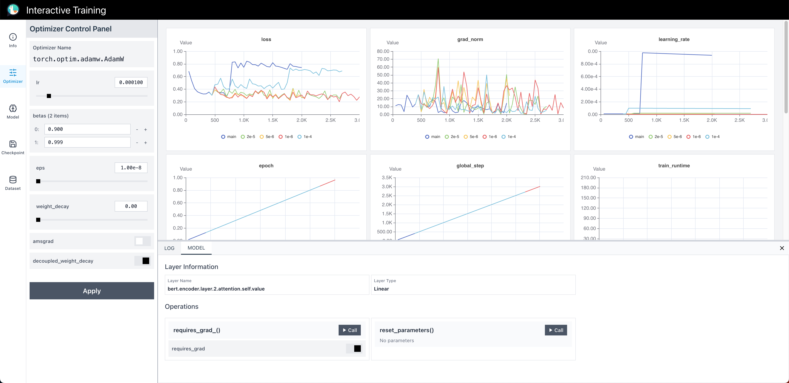

# Interactive Training: Feedback-Driven Neural Network Optimization

[](https://github.com/yuntian-group/interactive-training)
[](https://interactivetraining.ai)
[](https://python.org)
[](LICENSE)

Interactive Training is an open-source framework that enables real-time, feedback-driven intervention during neural network training. Unlike traditional static training approaches, Interactive Training allows human experts or automated AI agents to dynamically adjust optimizer parameters, training data, and model checkpoints while training is in progress.

## 🖼 Preview



## 🎮 Try the Interactive Demo

Play our interactive game at [**interactivetraining.ai**](https://interactivetraining.ai/) experience the power of dynamic optimization control.

## 🚀 Key Features

- **Real-time Interventions**: Dynamically adjust learning rates, optimizer parameters, and training configurations during training
- **Interactive Dashboard**: React-based frontend for visualizing training metrics and sending control commands
- **Checkpoint Management**: Save, load, and branch training trajectories with full history tracking
- **LLM-based Tuning**: Enable LLM-based agents to automatically optimize training parameters
- **Easy Integration**: Minimal code changes required - just wrap your existing Hugging Face Trainer
- **Branching Support**: Create and manage multiple training branches from any checkpoint
- **WebSocket Communication**: Real-time bidirectional communication between training process and dashboard

## 🏗️ Architecture

Interactive Training consists of three main components:

```
┌─────────────────────┐    ┌─────────────────────┐    ┌─────────────────────┐
│  Frontend Dashboard │◄──►│   Control Server    │◄──►│ Interactive Trainer │
│   (React/TypeScript)│    │    (FastAPI)        │    │ (HuggingFace Trainer│
│                     │    │                     │    │     + Callbacks)    │
└─────────────────────┘    └─────────────────────┘    └─────────────────────┘
```

- **Control Server**: FastAPI-based server that mediates communication between frontend and trainer
- **Interactive Trainer**: Extended Hugging Face Trainer with real-time intervention capabilities
- **Frontend Dashboard**: React-based visualization and control interface

## 📦 Installation

### Prerequisites

- Python 3.8+
- Node.js 16+ (for frontend development)

### Python Package Installation

```bash
# Clone the repository
git clone https://github.com/yuntian-group/interactive-training.git
cd interactive-training

# Install the package
pip install -e .
```

### Frontend Setup (Optional)

If you want to use the interactive dashboard:

```bash
cd frontend/interactive_optimizer
npm install
npm run build
```

## 🔧 Quick Start

### Basic Usage

Transform your existing Hugging Face training script with just 3 lines of code:

```python
from transformers import Trainer
from interactive_training import make_interactive  # 1. Import helper

# 2. Wrap the standard Trainer class
InteractiveTrainer = make_interactive(Trainer)

# 3. Use InteractiveTrainer exactly as you would the original Trainer
trainer = InteractiveTrainer(
    model=model,
    args=training_args,
    train_dataset=train_dataset,
    eval_dataset=eval_dataset,
    tokenizer=tokenizer,
    data_collator=data_collator,
)

trainer.train()  # Training is now fully interactive!
```

### Complete Example

```python
import wandb
import argparse
from datasets import load_dataset
from transformers import (
    Trainer,
    AutoConfig,
    AutoTokenizer,
    TrainingArguments,
    GPT2LMHeadModel,
    DataCollatorForLanguageModeling,
)

from interactive_training import make_interactive


def main(args):
    model_name = "openai-community/gpt2"
    data_name = "wikitext"
    data_part = "wikitext-2-raw-v1"
    wandb.init(project="interactive-trainer-wikitext")
    config = AutoConfig.from_pretrained(model_name)
    model = GPT2LMHeadModel(config=config)
    tokenizer = AutoTokenizer.from_pretrained(model_name)
    collator = DataCollatorForLanguageModeling(
        tokenizer=tokenizer, mlm=False, pad_to_multiple_of=8
    )
    tokenizer.pad_token = tokenizer.eos_token
    tokenizer.padding_side = "left"
    args = TrainingArguments(
        output_dir="./wikitext2",
        per_device_train_batch_size=16,
        per_device_eval_batch_size=16,
        gradient_accumulation_steps=1,
        num_train_epochs=5,
        learning_rate=args.lr,
        logging_steps=10,
        save_steps=1000,
        eval_steps=1000,
        eval_strategy="steps",
        fp16=True,
        report_to="wandb",
        eval_on_start=False,
    )

    train_data = load_dataset(data_name, data_part, split="train")
    eval_data = load_dataset(data_name, data_part, split="validation")

    def tokenize_function(examples):
        return tokenizer(
            examples["text"], truncation=True, max_length=1024, padding="longest"
        )

    train_data = train_data.filter(lambda x: len(x["text"]) > 0).map(
        tokenize_function, batched=True, remove_columns=["text"]
    )
    eval_data = eval_data.filter(lambda x: len(x["text"]) > 0).map(
        tokenize_function, batched=True, remove_columns=["text"]
    )

    InteractiveTrainer = make_interactive(Trainer)

    trainer = InteractiveTrainer(
        model=model,
        args=args,
        train_dataset=train_data,
        eval_dataset=eval_data,
        tokenizer=tokenizer,
        data_collator=collator,
    )
    trainer.train()


if __name__ == "__main__":
    parser = argparse.ArgumentParser(description="Train GPT-2 on WikiText-2")
    parser.add_argument(
        "--lr", type=float, default=1e-4, help="Learning rate for training"
    )
    args = parser.parse_args()
    main(args)

```

## 🖥️ Interactive Dashboard

Start your training script, you may see:

```bash
INFO:     Started server process [1755315]
INFO:     Waiting for application startup.
INFO:     Application startup complete.
INFO:     Uvicorn running on http://127.0.0.1:7007 (Press CTRL+C to quit)
```

Then open the interactive dashboard in browser:

```bash
# Your training script will automatically start the control server
# Open your browser and navigate to:
http://127.0.0.1:7007
```

The dashboard provides:
- **Real-time metrics visualization** (loss, learning rate, gradient norms)
- **Control panels** for optimizer, checkpoints, and model management
- **Command history** and status tracking
- **Branching visualization** for experiment management

## 🤖 LLM-based tuning 

A simple LLM based tuning exampled is included in `examples/llm_as_tuner.py`

## 📚 API Reference

### Supported Commands

| Command | Description | Parameters Example |
|---------|-------------|------------|
| `update_optimizer` | Modify optimizer parameters | `{"lr": 1e-4, "weight_decay": 0.01}` |
| `save_checkpoint` | Save current training state | `{}` |
| `load_checkpoint` | Load previous checkpoint | `{"uuid": "checkpoint_id", "branch_name": "new_branch"}` |
| `pause_training` | Pause training execution | `{}` |
| `resume_training` | Resume paused training | `{}` |
| `stop_training` | Stop training entirely | `{}` |
| `do_evaluate` | Trigger evaluation | `{}` |
| `update_dataset` | Update dataset reload information | `{"data_source": ["openai/gsm8k", "juletxara/mgsm"]}` |
| `update_dataset_runtime_hyperparameters` | Update dataset run time hyper-parameters | `{"sample_prob": [0.9, 0.1]}` |
| `model_layer_operation` | Run a function associate with a layer | `{"layer_name": "bert.encoder.layer.0.attention.self.query", "operation_name": "reset_parameters", "params": {}}` |
| `model_layer_parameter_update` | Update layer hyperparameter | `{"layer_name": "bert.embeddings.dropout", "param_name": "p", "value": 0.5}` |

### REST API Endpoints

- `GET /api/get_info/` - Get current training state
- `GET /api/get_dataset_info/` - Get current dataset initialization and run-time parameters
- `GET /api/get_optimizer_info/` - Get optimizer parameters
- `GET /api/get_model_info/` - Get model information
- `GET /api/get_checkpoints/` - Get saved checkpoints
- `GET /api/get_logs/` - Get training logs
- `POST /api/command/` - Send intervention command
- `WebSocket /ws/message/` - Real-time event stream

## 📁 Repository Structure

```
interactive_training/
├── dist                            # Compiled Dashboard Files
├── __init__.py                     # Main package interface
├── interactive_dataset_mixin.py    # Interactive dataset mixin class
├── interactive_training_mixin.py   # Interactive training mixin class
├── interactive_training_server.py  # FastAPI control server
├── callbacks.py                    # Training callbacks for interventions
├── constants.py                    # Command constants and types
├── examples/                       # Example scripts and templates
│   ├── train_wikitext-2_gpt2.py    # Basic training example
│   ├── llm_as_tuner.py             # LLM agent example
│   └── llm_prompt_template.md      # LLM agent prompt template
├── frontend/                       # React-based dashboard
│   └── interactive_optimizer/      # Frontend application
├── init.sh                         # Setting up environmental variable script 
├── pyproject.toml                  # Python package configuration
└── README.md                       # This file
```

### Key Files

- **`src/interactive_training_mixin.py`**: Core mixin class that adds interactivity to Hugging Face Trainer
- **`src/interactive_dataset_mixin.py`**: Core mixin class that adds interactivity to dataset classes
- **`src/interactive_training_server.py`**: FastAPI server handling command/event routing
- **`src/callbacks.py`**: Training callbacks for different intervention types
- **`examples/train_wikitext-2_gpt2.py`**: Complete example showing basic usage
- **`examples/llm_as_tuner.py`**: Example of LLM-based automated optimization

## 📝 TODO 

- [ ] Support distributed training
- [ ] Better LLM agent support and integration
- [ ] Add unit tests
- [ ] Improve documentation
- [ ] And more ...

## 🤝 Contributing

We welcome contributions!


## 📖 Citation

If you use Interactive Training in your research, please cite:

```bibtex
@article{interactive_training_2024,
  title={Interactive Training: Feedback-Driven Neural Network Optimization},
  author={Wentao Zhang, Yang Young Lu, Yuntian Deng},
  url={https://github.com/yuntian-group/interactive-training},
  year={2025}
}
```
